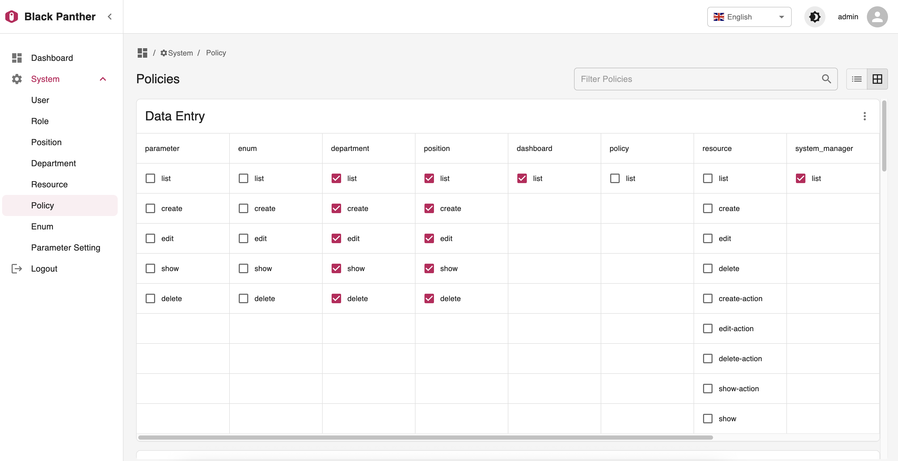
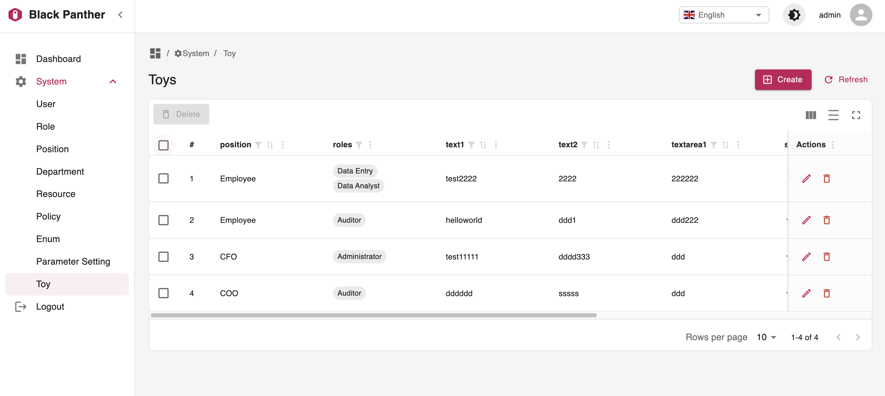

<p align="center">
  <a href="https://github.com/bigrivi/black-panther">
  
  </a>
</p>
<p align="center" markdown=1>
  <i>Full-stack Web application scaffolding,low-code builder, the perfect combination of <b>Refine</b> and <b>BetterCRUD</b></i>
</p>
<hr>
<p align="center">
    
</p>

**BlackPanther** is a complete full-stack web application scaffolding that uses FastAPI, BetterCRUD, Refine, and more.
He has defined a set of good front-end and back-end development best practices to quickly develop products such as CRM, CMS, Admin Dashboard and other different types of management systems

At the same time, **BlackPanther** is also a low-code builder that provides a series of low-code components and solutions

I like [Refine](https://refine.dev/) very much, I think it's a good solution for the front-end to produce products quickly, and I have always hoped that Refine can be combined with [BetterCRUD](https://github.com/bigrivi/better_crud) to generate strong productivity, which is also the original intention of this project

⭐ If you find BlackPanther useful, please consider giving us a star on GitHub! Your support helps us continue to innovate and deliver exciting features.

## Technology Stack

- ⚡ [**FastAPI**](https://fastapi.tiangolo.com) for the Python backend API.
    - ✒️ [BetterCRUD](https://github.com/bigrivi/better_crud) Quickly implement CRUD functions
    - 🧰 [SQLModel](https://sqlmodel.tiangolo.com) for the Python SQL database interactions (ORM).
    - 🔍 [Pydantic](https://docs.pydantic.dev), used by FastAPI, for the data validation and settings management.
- 🚀 [React](https://react.dev) for the frontend.
    - 🐱 Using TypeScript, hooks, Vite, and other parts of a modern frontend stack.
    - ☣️ [Refine](https://refine.dev/) for the frontend CRUD pages.
    - 🔷 [Material UI](material-ui.com) for the frontend ui components.
    - 🐩 [Material React Table](https://www.material-react-table.com/) for the list page tables
    - 💅 [react-hook-form-mui](https://github.com/dohomi/react-hook-form-mui) for the create/edit page forms

## All features
- 🎁 **Very nice front-end UI interface**:Thanks to the appearance of Material UI
- 🔑 **JWT** (JSON Web Token) authentication.
- 🔒 **Secure** password hashing by default.
- 🐼 **Login Authorization**
- 🐎 **Role-Based Access Control**:Powerful role-based asset action control
- 🐥 **Multi-language support**
- 🎓 **Dark mode support**
- 🎉 **Built-in Module**
  - 💿 **User Management**
  - 🎇 **Role Management**
  - 🎃 **Position Management**
  - 🔦 **Department Management**
  - 📲 **Resource Management**
  - 🔈 **Policy**
  - 🏠 **Enum Management**
  - 🌠 **Parameter setting**
  - 🎁 **Dynamic module**

<hr>

### Login


### Policy




### User
#### List

#### Create


### Role
#### List

#### Create


### Resource
#### List


#### Create


### Department
#### List


#### Create


### Enum
#### List


#### Edit


#### Sidebar mini mode


#### Chinese Simplified switch


#### Dark mode


### Dynamic module support

**Zero code on the front end**

Just define some special fields to describe the data in your backend model, and the frontend will be automatically generated.

```python
from typing import Optional, List
from datetime import datetime
from sqlmodel import SQLModel, Relationship, BIGINT
from app.common.model import BaseMixin
from app.common.model.field import Field
from app.enums import IntNameEnum
from app.modules.department.models import Department, DepartmentPublic
from .detail.models import ToyDetail, ToyDetailCreate, ToyDetailPublic


class Select1Enum(IntNameEnum):
    option1 = 1, "option1"
    option2 = 2, "option2"
    option3 = 3, "option3"


class ToyBase(SQLModel):
    tetx1: str = Field(value_type="text",
                       title="text1", description="description")
    tetx2: str = Field(default=None, value_type="text", title="text2")
    textarea1: Optional[str] = Field(
        default=None, value_type="textarea", title="textarea1")
    switch1: Optional[bool] = Field(
        default=True, value_type="switch", title="switch1", description="description")
    checkbox1: Optional[bool] = Field(
        default=True, value_type="checkbox", title="checkbox1", description="description")
    select1: Select1Enum | None = Field(
        enum=Select1Enum, default=Select1Enum.option1, value_type="select", title="select1", description="select1_description")
    department_id: Optional[int] = Field(
        default=None,
        title="department",
        value_type="treeSelect",
        sa_type=BIGINT,
        reference="department",
        hide_in_list=True,
        foreign_key="department.id",
        description="department_description"
    )


class Toy(ToyBase, BaseMixin, table=True):
    department: Optional[Department] = Relationship(
        sa_relationship_kwargs={"lazy": "noload"},
    )
    details: List[ToyDetail] = Relationship(
        sa_relationship_kwargs={
            "uselist": True,
            "cascade": "all, delete-orphan",
            "lazy": "noload"
        })


class ToyPublic(ToyBase):
    id: Optional[int]
    department: Optional[DepartmentPublic] = Field(
        title="department",
        value_type="treeSelect",
        reference="department",
        search_key="department_id"
    )
    created_at: Optional[datetime] = None
    details: List[ToyDetailPublic] = None


class ToyCreate(ToyBase):
    details: List[ToyDetailCreate] = Field(
        title="details", value_type="listTable", description="detail description")


class ToyUpdate(ToyBase):
    details: List[ToyDetailCreate] = None

```
The front end automatically generates lists and forms based on the json schema returned by the back end




## How To Use It
You can **just fork or clone** this repository and use it as is.
✨ It just works. ✨

## Backend Development

Backend docs: [backend/README.md](./backend/README.md).

## Frontend Development

Frontend docs: [frontend/README.md](./frontend/README.md).

## Why did you use Black Panther as the name of the project?
<p align="center">

</p>
Black Panther is the name of a stray cat I feed. It is very cute and obedient. We have a good relationship. My daughter gave it the name, which I think is good. I hope it can live a good life.

## Author

👤 **bigrivi**
* GitHub: [bigrivi](https://github.com/bigrivi)

## 🤝 Contributing

Contributions are what make the open source community such an amazing place to learn, inspire, and create. Any contributions you make are **greatly appreciated**.

If you have a suggestion that would make this better, please fork the repo and create a pull request. You can also simply open an issue with the tag "enhancement".
Don't forget to give the project a star! Thanks again!

1. Fork the Project
2. Create your Feature Branch (`git checkout -b feature/AmazingFeature`)
3. Commit your Changes (`git commit -m 'Add some AmazingFeature'`)
4. Push to the Branch (`git push origin feature/AmazingFeature`)
5. Open a Pull Request

## License

[MIT](LICENSE)