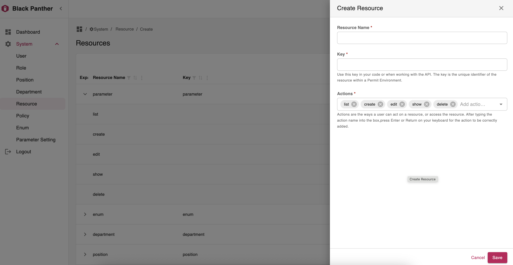

  

  <i>Full stack web application scaffold,The perfect combination of <b>Refine</b> and <b>BetterCRUD</b></i>

**BlackPanther** is a complete full-stack web application scaffolding that uses FastAPI, BetterCRUD, Refine, and more.
He has defined a set of good front-end and back-end development best practices to quickly develop products such as CRM, CMS, Admin Dashboard and other different types of management systems

I like [Refine](https://refine.dev/) very much, I think it's a good solution for the front-end to produce products quickly, and I have always hoped that Refine can be combined with [BetterCRUD](https://github.com/bigrivi/better_crud) to generate strong productivity, which is also the original intention of this project

⭐ If you find BlackPanther useful, please consider giving us a star on GitHub! Your support helps us continue to innovate and deliver exciting features.

## Technology Stack

- ⚡ [**FastAPI**](https://fastapi.tiangolo.com) for the Python backend API.
    - [BetterCRUD](https://github.com/bigrivi/better_crud) Quickly implement CRUD functions
    - [SQLModel](https://sqlmodel.tiangolo.com) for the Python SQL database interactions (ORM).
    - [Pydantic](https://docs.pydantic.dev), used by FastAPI, for the data validation and settings management.
- 🚀 [React](https://react.dev) for the frontend.
    - Using TypeScript, hooks, Vite, and other parts of a modern frontend stack.
    - [Refine](https://refine.dev/) for the frontend CRUD pages.
    - [Material UI](material-ui.com/zh/) for the frontend ui components.
    - [Material React Table](https://www.material-react-table.com/) for the list page tables
    - [react-hook-form-mui](https://github.com/dohomi/react-hook-form-mui) for the create/edit page forms

## All features
- **Very nice front-end UI interface**:Thanks to the appearance of Material UI
- **Login Authorization**
- **Role-Based Access Control**:Powerful role-based asset action control
- **Multi-language support**
- **Dark mode support**
- **Module List**
  - **User Management**
  - **Role Management**
  - **Position Management**
  - **Department Management**
  - **Resource Management**
  - **Policy**
  - **Enum Management**
  - **Parameter setting**

### Login

### Policy

### User
#### List

#### Create

### Role
#### List

#### Create

### Resource
#### List

#### Create

### Department
#### List

#### Create

### Enum
#### List

#### Edit

#### Sidebar mini mode

#### Chinese Simplified switch

#### Dark mode

## How To Use It
You can **just fork or clone** this repository and use it as is.
✨ It just works. ✨

## Backend Development

Backend docs: [backend/README.md](./backend/README.md).

## Frontend Development

Frontend docs: [frontend/README.md](./frontend/README.md).

## Why did you use Black Panther as the name of the project?
Black Panther is the name of a stray cat I feed. It is very cute and obedient. We have a good relationship. My daughter gave it the name, which I think is good. I hope it can live a good life.
